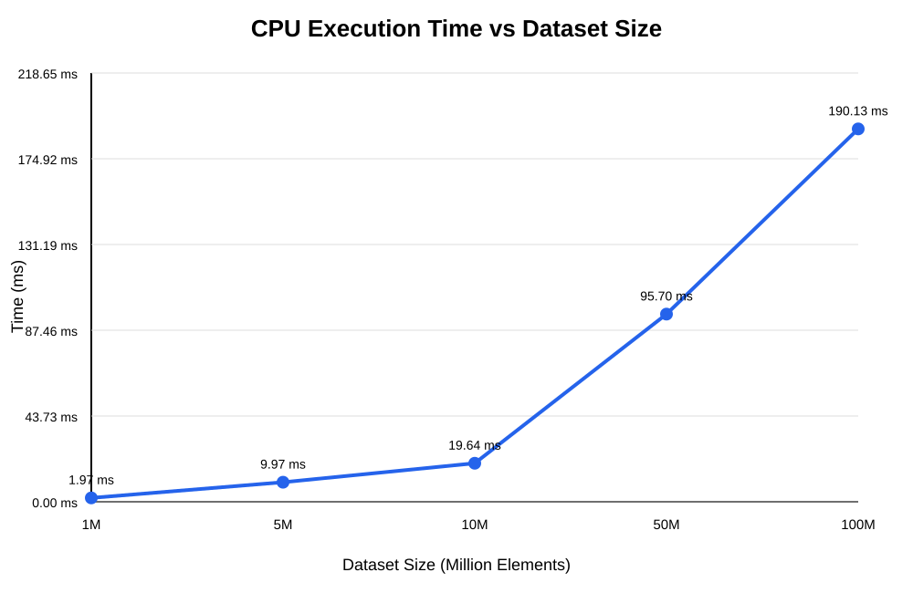
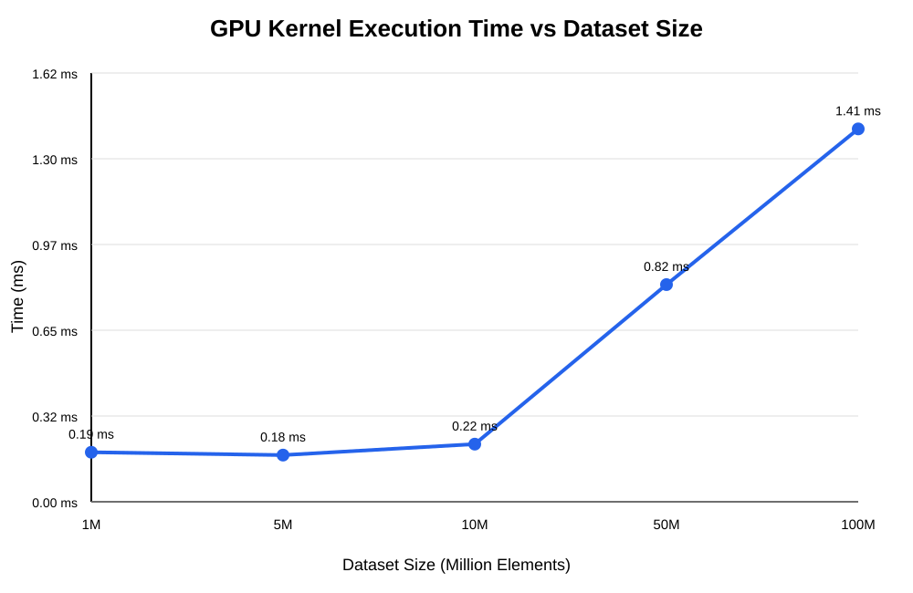
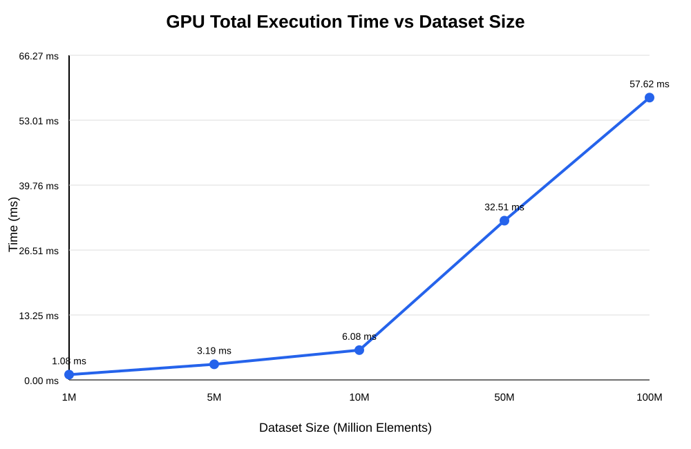
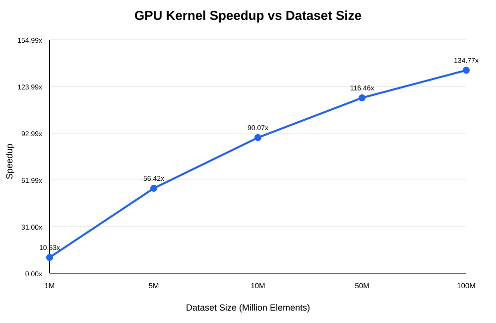
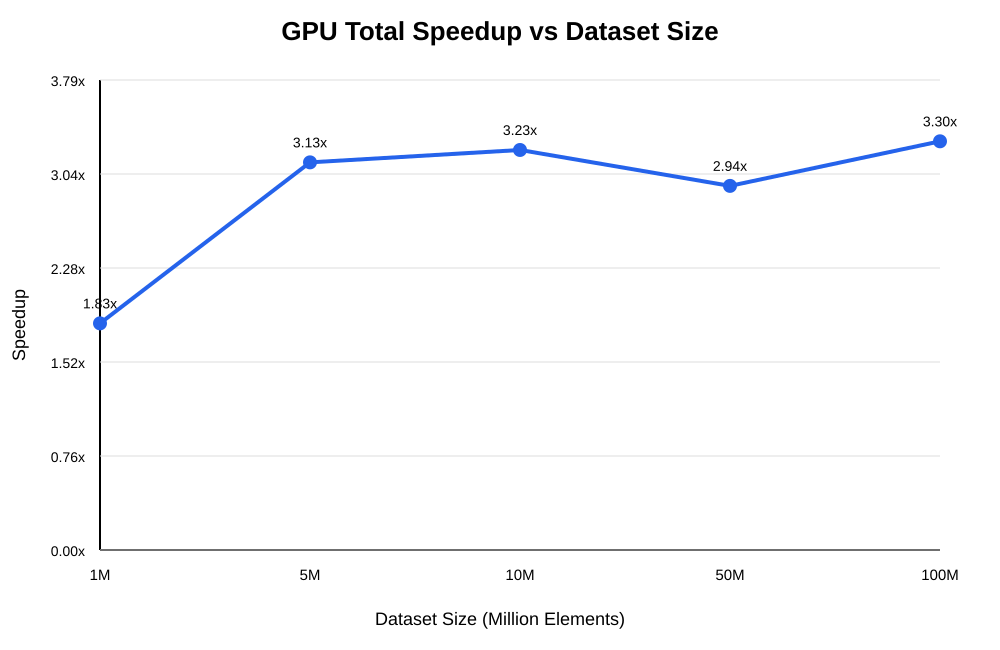

# GPU Dataset Processing Using CUDA

## Parallel Computing Lab Evaluation — Team 8

**Topic:** GPU Dataset Processing  
**Parallel Model:** NVIDIA CUDA  
**Benchmark GPU:** NVIDIA GeForce RTX 5060 Ti  
**CUDA Toolkit:** 13.4

---

## 1. Objective

The objective of this project is to process large numerical datasets using CUDA and compare sequential CPU processing with parallel GPU processing.

The program performs the following operations:

- SUM
- MINIMUM
- MAXIMUM
- AVERAGE

The experiment compares:

1. Sequential CPU processing
2. Parallel CUDA GPU processing

The measured metrics include:

- CPU execution time
- GPU kernel execution time
- GPU total measured processing time
- Numerical validation
- Kernel-only speedup
- Total measured speedup

---

## 2. Hardware and Software

### Hardware

- NVIDIA GeForce RTX 5060 Ti
- Approximately 16 GB VRAM
- Compute Capability 12.0

### Software

- Windows
- NVIDIA Driver 610.88
- CUDA Toolkit 13.4
- Visual Studio 2026 Build Tools
- MSVC x64 compiler
- C++
- CUDA C++

The benchmark was executed on the PowerX PC using the NVIDIA GPU listed above.

CUDA programs were compiled for the target GPU architecture using:

```text
nvcc -arch=compute_120 -code=sm_120
```

---

## 3. Dataset

Synthetic floating-point datasets were generated using the Mersenne Twister random-number generator.

Each dataset uses:

```text
Random generator: std::mt19937
Seed: 42
Distribution: uniform_real_distribution<float>
Range: 0.0 to 1000.0
```

A fixed seed of `42` is used to make dataset generation reproducible.

Each element is stored as a 32-bit floating-point value.

### Dataset Sizes

| Dataset | Elements | Approx. Size |
|---:|---:|---:|
| 1M | 1,000,000 | 4 MB |
| 5M | 5,000,000 | 20 MB |
| 10M | 10,000,000 | 40 MB |
| 50M | 50,000,000 | 200 MB |
| 100M | 100,000,000 | 400 MB |

The binary datasets are generated locally and excluded from GitHub because of their size.

---

## 4. CUDA Implementation

The GPU implementation uses a parallel reduction strategy.

Each CUDA thread processes input elements using a grid-stride loop. Threads within a block compute partial results, which are then reduced using shared memory.

The GPU computes partial:

- Sum
- Minimum
- Maximum

The resulting block-level partial values are combined on the host.

### CUDA Configuration

```text
Threads per block: 256
Number of blocks: 256
Total launched threads: 65,536
```

The same launch configuration is used for all tested dataset sizes.

Because a grid-stride loop is used, each thread can process multiple input elements as the dataset size increases.

The implementation avoids global floating-point atomic operations for the main reduction.

---

## 5. Timing Methodology

### CPU Execution Time

CPU execution time represents the time required by the sequential CPU implementation to process all dataset elements.

### GPU Kernel Execution Time

GPU kernel execution time is measured using CUDA events around the CUDA kernel launch.

This represents the computation performed by the GPU kernel without including host-device memory transfers.

### GPU Total Measured Time

The GPU total measured time includes:

- Host-to-device memory transfer
- CUDA kernel execution
- Device-to-host memory transfer

File loading is excluded from these measurements.

**Note:** CUDA memory allocation and the final host-side aggregation of the block-level results are outside this measured interval. Therefore, this metric is referred to as **GPU Total Measured Time** rather than complete application end-to-end time.

This distinction is important because kernel-only speedup can be substantially higher than the measured total speedup when memory-transfer overhead contributes significantly to the processing time.

---

## 6. Benchmark Results

| Dataset | CPU Time (ms) | GPU Kernel (ms) | GPU Total Measured (ms) | Kernel Speedup | Total Speedup |
|---:|---:|---:|---:|---:|---:|
| 1M | 1.9734 | 0.187328 | 1.081184 | 10.53x | 1.83x |
| 5M | 9.9669 | 0.176640 | 3.189056 | 56.42x | 3.13x |
| 10M | 19.6427 | 0.218080 | 6.083776 | 90.07x | 3.23x |
| 50M | 95.6955 | 0.821696 | 32.505569 | 116.46x | 2.94x |
| 100M | 190.1299 | 1.410784 | 57.622017 | 134.77x | 3.30x |

### Speedup Calculation

Kernel speedup:

```text
Kernel Speedup = CPU Time / GPU Kernel Time
```

Measured total speedup:

```text
Total Speedup = CPU Time / GPU Total Measured Time
```

For example, for the 100M dataset:

```text
Kernel Speedup = 190.1299 / 1.410784
               ≈ 134.77x

Total Speedup = 190.1299 / 57.622017
              ≈ 3.30x
```

---

## 7. Validation

GPU results were compared against CPU reference results.

The minimum and maximum values matched across the tested datasets.

Average-value differences were approximately `0.000001` or smaller in the recorded benchmark results.

The SUM values show small numerical differences because CPU and GPU reductions use different floating-point accumulation paths, including differences in accumulation order and intermediate precision.

For the 100M dataset:

```text
CPU SUM       = 49997551604.514511
GPU SUM       = 49997551456.000000
SUM difference = 148.514511
```

Although the absolute difference is `148.514511`, the CPU SUM is approximately `49.997 billion`, making the relative difference approximately:

```text
0.000000297%
```

Therefore, the SUM difference is extremely small relative to the total accumulated value.

Validation uses numerical tolerance rather than exact floating-point equality.

---

## 8. Performance Analysis

### CPU Scaling

CPU execution time increases substantially as the dataset size increases.

Selected measurements:

```text
1M   = 1.9734 ms
10M  = 19.6427 ms
100M = 190.1299 ms
```

The CPU processing time scales approximately with the number of input elements.

### GPU Kernel Performance

The CUDA kernel remains significantly faster than the sequential CPU computation.

Selected measurements:

```text
1M   = 0.187328 ms
100M = 1.410784 ms
```

Kernel-only speedup increases substantially as the dataset size grows:

```text
1M   = 10.53x
5M   = 56.42x
10M  = 90.07x
50M  = 116.46x
100M = 134.77x
```

The small difference between the 1M and 5M kernel measurements is expected from GPU timing variability at very small execution times. The larger datasets show the scaling behaviour more clearly.

### Measured Total Performance

When host-device memory transfers are included, the measured total speedup is lower than the kernel-only speedup.

```text
1M   = 1.83x
5M   = 3.13x
10M  = 3.23x
50M  = 2.94x
100M = 3.30x
```

This demonstrates that memory-transfer overhead contributes significantly to the overall measured GPU processing time.

---

## 9. Graphs

The project includes five SVG graphs generated from the benchmark results.

### CPU Execution Time



### GPU Kernel Execution Time



### GPU Total Measured Time



### Kernel Speedup



### Total Measured Speedup



SVG format is used so the graphs remain clear when included in reports and presentations.

---

## 10. Project Structure

```text
GPU-Dataset-Processing/
│
├── data/                         # Generated locally; not tracked by Git
│   ├── dataset_1M.bin
│   ├── dataset_5M.bin
│   ├── dataset_10M.bin
│   ├── dataset_50M.bin
│   └── dataset_100M.bin
│
├── graphs/
│   ├── cpu_execution_time.svg
│   ├── gpu_kernel_time.svg
│   ├── gpu_total_time.svg
│   ├── kernel_speedup.svg
│   └── total_speedup.svg
│
├── results/
│   └── benchmark_results.csv
│
├── src/
│   ├── cuda_test.cu
│   ├── generate_dataset.cpp
│   ├── generate_dataset_5M.cpp
│   ├── generate_dataset_10M.cpp
│   ├── generate_dataset_50M.cpp
│   ├── generate_dataset_100M.cpp
│   ├── generate_graphs.cpp
│   ├── gpu_dataset.cu
│   ├── gpu_dataset_v1_working.cu
│   ├── gpu_benchmark.cu
│   ├── gpu_benchmark_5M.cu
│   ├── gpu_benchmark_10M.cu
│   ├── gpu_benchmark_50M.cu
│   └── gpu_benchmark_100M.cu
│
├── README.md
└── .gitignore
```

The `data/*.bin` files are generated locally and are intentionally excluded from the repository.

---

## 11. Build Instructions

Open an **x64 Native Tools Command Prompt for Visual Studio** on a system with the required NVIDIA CUDA environment.

Navigate to the project directory:

```bat
cd /d C:\Users\PowerX\GPU-Dataset-Processing
```

### Compile the main CUDA benchmark

```bat
nvcc -arch=compute_120 -code=sm_120 .\src\gpu_benchmark.cu -o .\gpu_benchmark.exe
```

Run:

```bat
.\gpu_benchmark.exe
```

The same procedure can be used with the dataset-specific benchmark programs.

---

## 12. Reproducing the Experiment

The benchmark datasets can be generated using the provided C++ dataset generators.

The generators create the binary files inside the project's `data` directory.

### Example: Generate the 100M Dataset

Compile:

```bat
cl .\src\generate_dataset_100M.cpp /EHsc /Fe:.\generate_dataset_100M.exe
```

Run:

```bat
.\generate_dataset_100M.exe
```

The program generates:

```text
data\dataset_100M.bin
```

with:

```text
100,000,000 floating-point elements
Approximately 400 MB
Random seed: 42
Value range: 0.0 to 1000.0
```

### Compile the 100M CUDA Benchmark

```bat
nvcc -arch=compute_120 -code=sm_120 .\src\gpu_benchmark_100M.cu -o .\gpu_benchmark_100M.exe
```

Run:

```bat
.\gpu_benchmark_100M.exe
```

The same approach applies to the 1M, 5M, 10M and 50M datasets.

---

## 13. Results Summary

The experiment demonstrates the difference between GPU kernel acceleration and measured GPU processing performance that includes data transfers.

The maximum measured kernel-only speedup was:

```text
134.77x
```

for the 100M-element dataset.

The maximum measured total speedup was:

```text
3.30x
```

for the 100M-element dataset.

The results demonstrate that CUDA parallel processing can substantially accelerate the computational portion of large numerical reductions, while host-device data transfers contribute significantly to the measured total processing time.

---

## 14. Team

**Parallel Computing Lab Evaluation — Team 8**

**Topic:** GPU Dataset Processing  
**Technology:** NVIDIA CUDA
