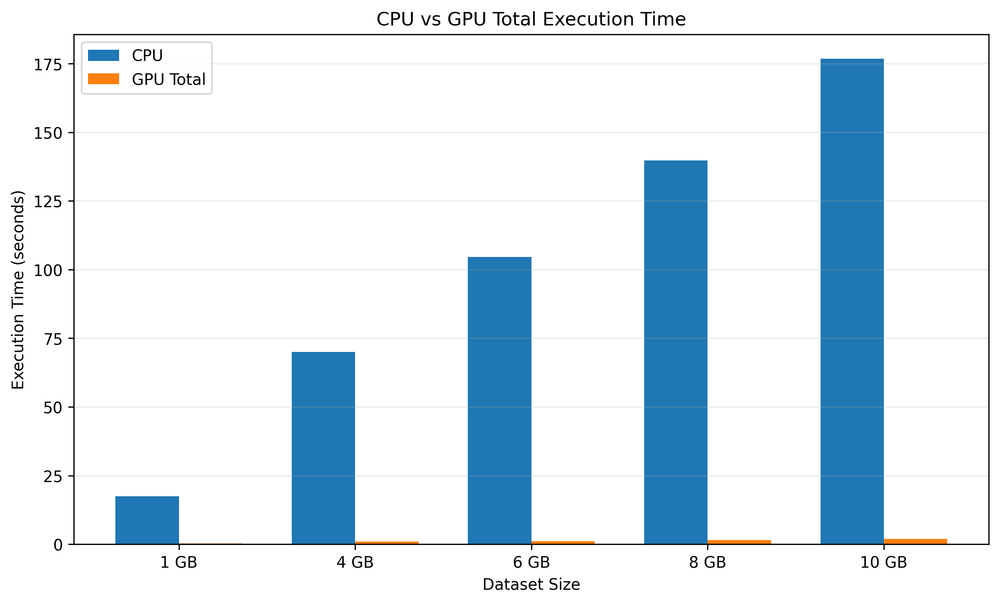
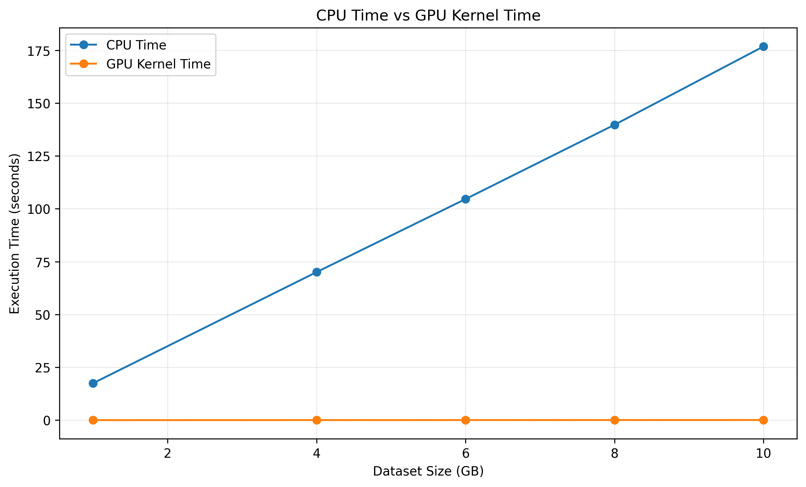
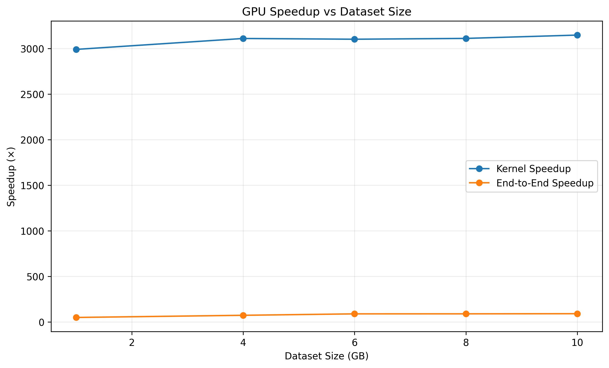

# 🚀 GPU Dataset Processing Using CUDA

A CUDA-based GPU acceleration project that processes large numerical datasets and compares **CPU performance against NVIDIA GPU performance**.

The project demonstrates how parallel processing with CUDA can significantly reduce execution time when processing large-scale numerical workloads.

---

## 🎯 Objective

The objective of this project is to:

- Process large numerical datasets using CUDA.
- Implement parallel dataset processing on the GPU.
- Compare CPU and GPU execution performance.
- Measure CUDA kernel execution time separately from total GPU execution time.
- Validate GPU results against CPU results.
- Analyze performance scaling as dataset size increases.

---

## 🧠 CUDA Approach

The dataset is represented using **32-bit floating-point (`float32`) values**.

The CUDA implementation uses:

- CUDA C++
- 256 threads per block
- 256 blocks
- Grid-stride loop for processing large datasets
- Shared-memory reduction
- GPU-based sum, minimum, and maximum calculation
- CPU/GPU result validation

Each GPU thread processes multiple elements using a grid-stride loop, allowing the implementation to handle datasets containing billions of elements.

---

## 💻 Hardware & Software

### Hardware

| Component | Specification |
|---|---|
| GPU | NVIDIA GeForce RTX 5060 Ti |
| GPU Memory | 16 GB |
| CUDA Compute Capability | 12.0 |
| Dataset Type | float32 |

### Software

| Component | Version |
|---|---|
| CUDA Toolkit | 13.4 |
| `nvcc` | 13.4.92 |
| Platform | Windows |
| Compiler | Visual Studio Build Tools |

---

## 📊 Benchmark Configuration

The experiment was performed using five dataset sizes:

- 1 GB
- 4 GB
- 6 GB
- 8 GB
- 10 GB

Each dataset uses:

```text
Element type       : float32
Compute iterations : 30
Threads per block  : 256
Blocks             : 256
```

The same workload configuration was used for every dataset size to ensure a consistent comparison.

---

# 📈 Benchmark Results

| Dataset | Elements | CPU Time | GPU Kernel | GPU Total | Kernel Speedup | Total Speedup |
|---:|---:|---:|---:|---:|---:|---:|
| 1 GB | 250M | 17.477 s | 5.84 ms | 0.351 s | 2990.26× | 49.84× |
| 4 GB | 1B | 70.036 s | 22.52 ms | 0.951 s | 3109.95× | 73.62× |
| 6 GB | 1.5B | 104.602 s | 33.72 ms | 1.170 s | 3101.82× | 89.37× |
| 8 GB | 2B | 139.757 s | 44.93 ms | 1.560 s | 3110.78× | 89.59× |
| 10 GB | 2.5B | 176.815 s | 56.18 ms | 1.940 s | 3147.23× | 91.13× |

---

## 📉 CPU vs GPU Total Execution Time

The GPU provides a substantial reduction in end-to-end execution time compared with CPU processing.



---

## ⚡ CPU vs GPU Kernel Execution

The CUDA kernel processes the same workloads in milliseconds, demonstrating the advantage of massively parallel GPU execution.



---

## 🚀 GPU Speedup

The measured speedup increases significantly as the dataset size grows.



At the largest tested workload:

```text
Dataset          : 10 GB
Elements         : 2.5 billion
CPU time         : 176.815 s
GPU kernel time  : 56.18 ms
GPU total time   : 1.940 s

Kernel speedup   : 3147.23×
End-to-end speedup : 91.13×
```

---

# ✅ Validation

GPU results were compared against the CPU implementation for every dataset size.

For the completed experiments:

```text
SUM difference     : 0.00
MIN difference     : 0.00
MAX difference     : 0.00
AVERAGE difference : 0.00
```

All five dataset sizes successfully passed validation.

---

# 💾 GPU Memory Scaling

The GPU dataset allocation scaled directly with the dataset size.

| Dataset | GPU Allocation | Free VRAM After Allocation |
|---:|---:|---:|
| 1 GB | 1.00 GB | 14.91 GB |
| 4 GB | 4.00 GB | 11.91 GB |
| 6 GB | 6.00 GB | 9.91 GB |
| 8 GB | 8.00 GB | 7.91 GB |
| 10 GB | 10.00 GB | 5.91 GB |

The 10 GB experiment completed successfully on the RTX 5060 Ti without GPU memory exhaustion.

---

# 📁 Project Structure

```text
GPU-Dataset-Processing/
│
├── data/
│
├── graphs/
│   ├── cpu_vs_gpu_total_time.png
│   ├── cpu_vs_gpu_kernel_time.png
│   ├── gpu_speedup_vs_dataset_size.png
│   └── benchmark_results.csv
│
├── results/
│
├── src/
│   ├── gpu_benchmark.cu
│   ├── gpu_dataset.cu
│   ├── gpu_graphs.cu
│   ├── cuda_test.cu
│   └── ...
│
└── README.md
```

---

# ⚙️ Compilation

Compile the CUDA benchmark using:

```powershell
nvcc -O3 -arch=compute_120 -code=sm_120 gpu_benchmark.cu -o gpu_benchmark.exe
```

Run the benchmark by specifying the dataset size:

```powershell
.\gpu_benchmark.exe 1
```

Supported dataset sizes:

```text
1 GB
4 GB
6 GB
8 GB
10 GB
```

Examples:

```powershell
.\gpu_benchmark.exe 1
.\gpu_benchmark.exe 4
.\gpu_benchmark.exe 6
.\gpu_benchmark.exe 8
.\gpu_benchmark.exe 10
```

---

# 🔬 Performance Analysis

The benchmark demonstrates a clear advantage for GPU-based parallel processing.

As the dataset increases from **1 GB to 10 GB**:

- CPU execution time increases from **17.48 s to 176.82 s**.
- GPU kernel execution increases only from **5.84 ms to 56.18 ms**.
- GPU total execution increases from **0.351 s to 1.940 s**.
- End-to-end GPU speedup reaches **91.13×** at 10 GB.
- CUDA kernel speedup reaches **3147.23×** at 10 GB.

The results demonstrate how GPU parallelism becomes particularly valuable for large-scale numerical dataset processing.

---

# 🏁 Conclusion

This project successfully demonstrates GPU acceleration of large-scale numerical dataset processing using CUDA.

The experiment processed datasets up to **10 GB**, containing **2.5 billion float32 elements**, while maintaining successful CPU/GPU validation.

The final 10 GB benchmark achieved:

```text
91.13× end-to-end speedup
3147.23× CUDA kernel speedup
```

These results demonstrate the effectiveness of CUDA parallel processing for computationally intensive numerical workloads.

---

## 👥 Team

**Team 8 — GPU Dataset Processing**

---

## 🛠️ Technologies

- CUDA
- CUDA C++
- NVIDIA RTX 5060 Ti
- C++
- Visual Studio Build Tools
- PowerShell
- Python / Matplotlib
- Git & GitHub
