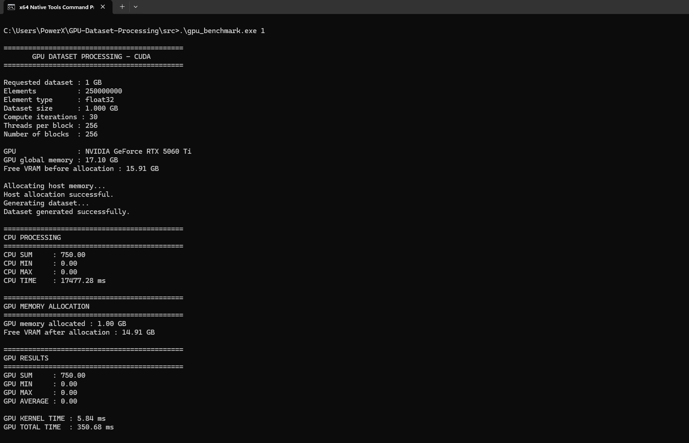
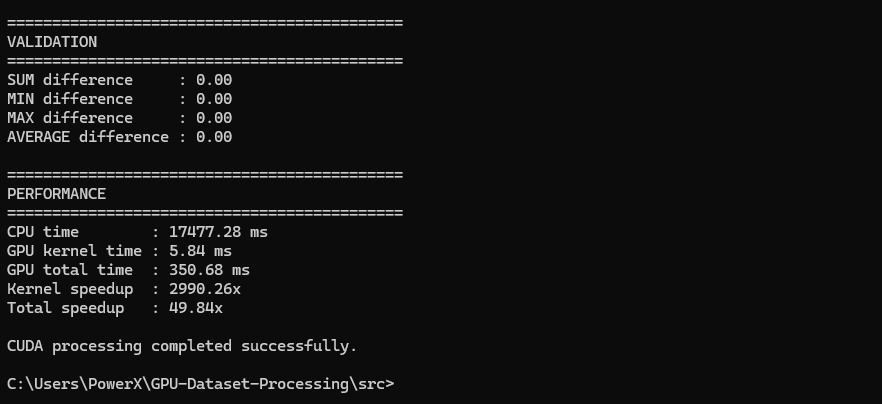
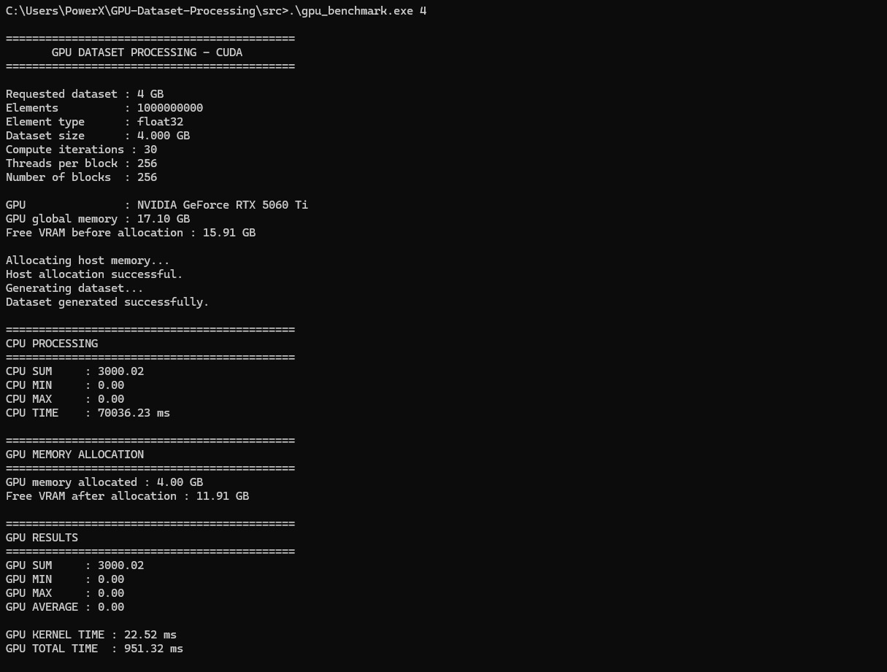
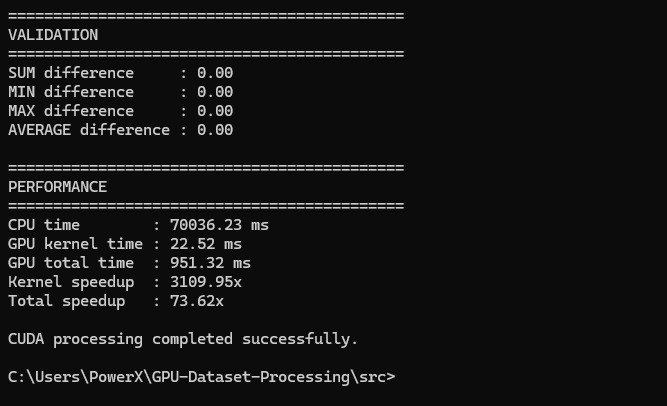
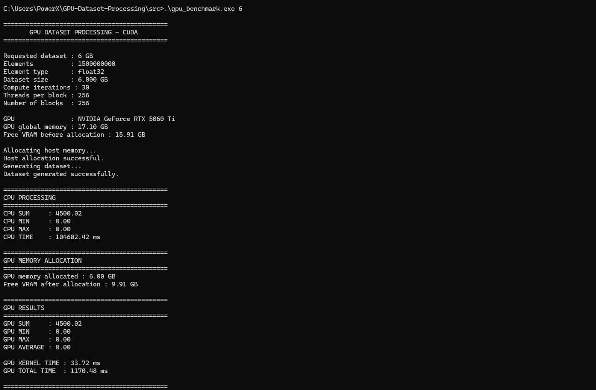
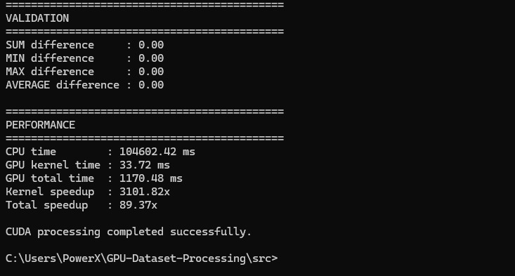
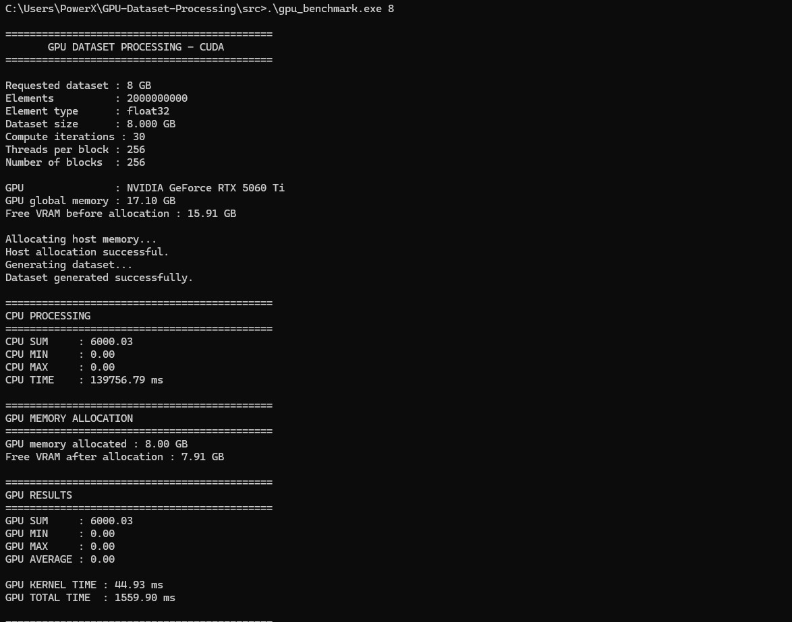
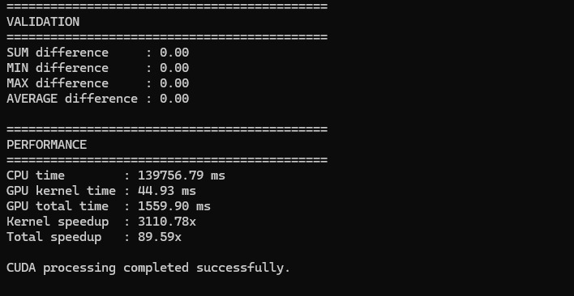
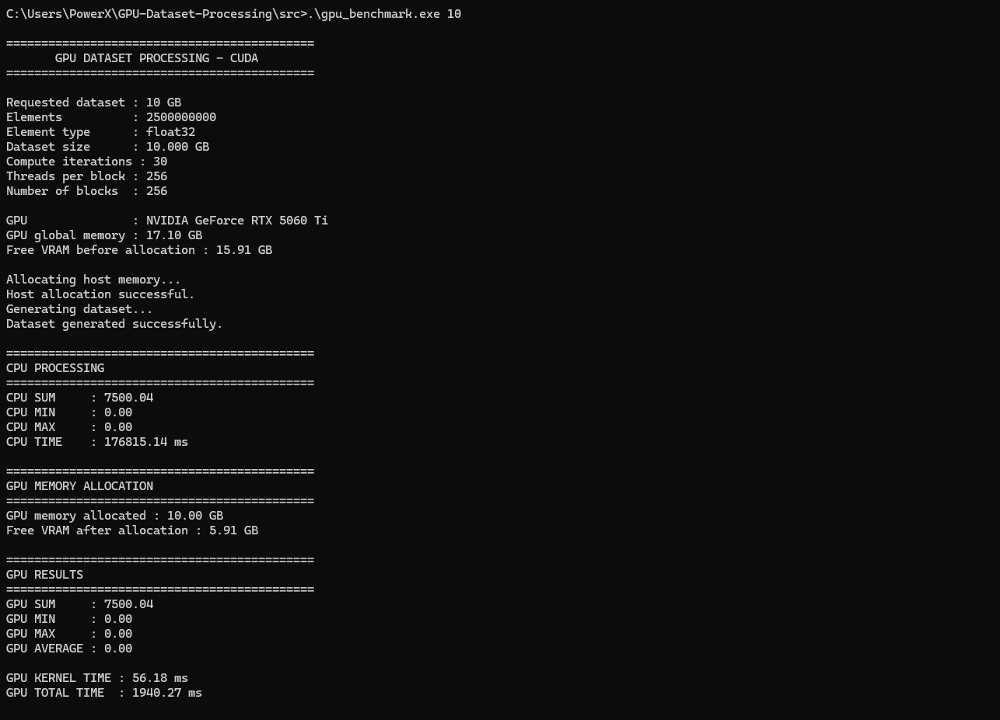
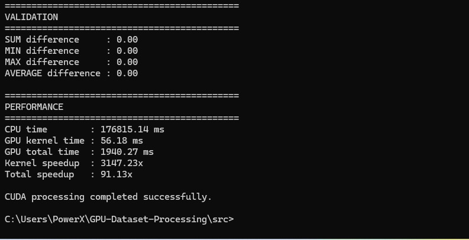

# 🚀 GPU Dataset Processing Using CUDA

A CUDA-based GPU acceleration project that processes large-scale numerical datasets and compares **CPU performance with NVIDIA GPU performance**.

The project demonstrates how CUDA parallel processing can significantly reduce execution time for computationally intensive numerical workloads.

---

## 🎯 Objective

The objectives of this project are to:

- Process large numerical datasets using CUDA.
- Implement parallel numerical processing on the GPU.
- Compare CPU and GPU execution performance.
- Measure CUDA kernel execution time separately from total GPU execution time.
- Validate GPU results against CPU results.
- Analyze performance scaling as dataset size increases.

---

## 🧠 CUDA Approach

The dataset is processed using **32-bit floating-point (`float32`) values**.

The CUDA implementation uses:

- CUDA C++
- 256 threads per block
- 256 blocks
- Grid-stride loop
- Shared-memory reduction
- GPU-based numerical processing
- CPU/GPU result validation

The grid-stride loop allows individual GPU threads to process multiple elements, making the implementation suitable for datasets containing **billions of elements**.

---

## 💻 Hardware & Software

### Hardware

| Component | Specification |
|---|---|
| GPU | NVIDIA GeForce RTX 5060 Ti |
| GPU Memory | 16 GB |
| Dataset Type | float32 |
| Platform | Windows |

### Software

| Component | Version |
|---|---|
| CUDA Toolkit | 13.4 |
| NVCC | 13.4.92 |
| Compiler | Visual Studio Build Tools |
| Language | CUDA C++ |
| Graphing | Python / Matplotlib |

---

## 📊 Benchmark Configuration

Five dataset sizes were tested:

- **1 GB**
- **4 GB**
- **6 GB**
- **8 GB**
- **10 GB**

Each dataset uses the same processing configuration.

| Parameter | Value |
|---|---:|
| Data type | float32 |
| Compute iterations | 30 |
| Threads per block | 256 |
| Blocks | 256 |
| Maximum dataset | 10 GB |
| Maximum elements | 2.5 billion |

---

# 📈 Benchmark Results

| Dataset | Elements | CPU Time (s) | GPU Kernel (ms) | GPU Total (s) | Kernel Speedup | Total Speedup |
|---|---:|---:|---:|---:|---:|---:|
| 1 GB | 250,000,000 | 17.477 | 5.84 | 0.351 | 2990.26× | 49.84× |
| 4 GB | 1,000,000,000 | 70.036 | 22.52 | 0.951 | 3109.95× | 73.62× |
| 6 GB | 1,500,000,000 | 104.602 | 33.72 | 1.170 | 3101.82× | 89.37× |
| 8 GB | 2,000,000,000 | 139.757 | 44.93 | 1.560 | 3110.78× | 89.59× |
| 10 GB | 2,500,000,000 | 176.815 | 56.18 | 1.940 | 3147.23× | 91.13× |

---

# 📉 CPU vs GPU Total Execution Time


The GPU significantly reduces the total execution time compared with CPU processing.

For the largest 10 GB dataset:

- CPU: **176.815 seconds**
- GPU total: **1.940 seconds**
- End-to-end speedup: **91.13×**

---

# ⚡ CPU vs GPU Kernel Execution


The CUDA kernel processes the workloads in milliseconds, demonstrating the advantage of massively parallel GPU execution.

For the 10 GB workload:

- CPU: **176.815 seconds**
- GPU kernel: **56.18 milliseconds**
- Kernel speedup: **3147.23×**

---

# 🚀 GPU Speedup vs Dataset Size


The results demonstrate strong GPU acceleration as the workload increases.

The end-to-end GPU speedup reaches **91.13×** for the 10 GB dataset.

---

# 🏆 Largest Experiment — 10 GB

The largest successfully processed dataset was **10 GB**, containing:

- **2.5 billion float32 elements**
- CPU execution time: **176.815 s**
- GPU kernel time: **56.18 ms**
- GPU total execution time: **1.940 s**
- Kernel speedup: **3147.23×**
- End-to-end speedup: **91.13×**

The 10 GB workload completed successfully without GPU memory exhaustion.

---

# ✅ Validation

GPU results were compared against CPU results for every tested dataset size.

The validation results showed:

```text
SUM difference     = 0.00
MIN difference     = 0.00
MAX difference     = 0.00
AVERAGE difference = 0.00
```

All five dataset sizes successfully passed CPU/GPU validation.

---

# 💾 GPU Memory Scaling

| Dataset | GPU Allocation | Free VRAM After Allocation |
|---|---:|---:|
| 1 GB | 1.00 GB | 14.91 GB |
| 4 GB | 4.00 GB | 11.91 GB |
| 6 GB | 6.00 GB | 9.91 GB |
| 8 GB | 8.00 GB | 7.91 GB |
| 10 GB | 10.00 GB | 5.91 GB |

The 10 GB dataset successfully fit into the available GPU memory while leaving approximately **5.91 GB of free VRAM** after allocation.

---

## 📸 Experiment Screenshots

### 1 GB




### 4 GB




### 6 GB




### 8 GB




### 10 GB




# 📁 Project Structure

```text
GPU-Dataset-Processing/
│
├── data/
│
├── graphs/
│   ├── cpu_vs_gpu_total_time.png
│   ├── cpu_vs_gpu_kernel_time.png
│   ├── gpu_speedup_vs_dataset_size.png
│   └── benchmark_results.csv
│
├── screenshots/
│   ├── 1Gb_1.jpeg
│   ├── 1GB_2.jpeg
│   ├── 4GB_1.jpeg
│   ├── 4GB_2.jpeg
│   ├── 6GB_1.jpeg
│   ├── 6GB_2.jpeg
│   ├── 8GB_1.jpeg
│   ├── 8GB_2.jpeg
│   ├── 10GB_1.jpeg
│   └── 10Gb_2.jpeg
│
├── results/
│
├── src/
│   ├── gpu_benchmark.cu
│   ├── gpu_dataset.cu
│   ├── gpu_graphs.cu
│   ├── cuda_test.cu
│   └── ...
│
└── README.md
```

---

# ⚙️ Compilation

Navigate to the `src` directory:

```powershell
cd C:\Users\PowerX\GPU-Dataset-Processing\src
```

Compile the CUDA benchmark:

```powershell
nvcc -O3 -arch=compute_120 -code=sm_120 gpu_benchmark.cu -o gpu_benchmark.exe
```

---

# ▶️ Running the Benchmark

Run the benchmark by specifying the dataset size:

```powershell
.\gpu_benchmark.exe 1
```

```powershell
.\gpu_benchmark.exe 4
```

```powershell
.\gpu_benchmark.exe 6
```

```powershell
.\gpu_benchmark.exe 8
```

```powershell
.\gpu_benchmark.exe 10
```

Supported dataset sizes:

```text
1 GB
4 GB
6 GB
8 GB
10 GB
```

---

# 🔬 Performance Analysis

The benchmark demonstrates a substantial performance advantage for GPU processing.

As the dataset increases from **1 GB to 10 GB**:

- CPU execution increases from **17.477 s to 176.815 s**.
- GPU kernel execution increases from **5.84 ms to 56.18 ms**.
- GPU total execution increases from **0.351 s to 1.940 s**.
- End-to-end speedup reaches **91.13×**.
- CUDA kernel speedup reaches **3147.23×**.

The performance difference becomes especially significant for large workloads, where CPU processing requires tens or hundreds of seconds while GPU processing completes in a few seconds or less.

---

# 🏁 Conclusion

This project successfully demonstrates **GPU acceleration of large-scale numerical dataset processing using CUDA**.

The experiment processed datasets ranging from **1 GB to 10 GB**, with the largest workload containing **2.5 billion float32 elements**.

The final 10 GB experiment achieved:

```text
CPU Time              : 176.815 s
GPU Kernel Time       : 56.18 ms
GPU Total Time        : 1.940 s
Kernel Speedup        : 3147.23×
End-to-End Speedup    : 91.13×
```

All tested workloads successfully passed CPU/GPU validation.

The results demonstrate that CUDA-based parallel processing can provide substantial performance improvements for large numerical workloads.

---

## 👥 Team

**Team 8 — GPU Dataset Processing**

---

## 🛠️ Technologies

- CUDA
- CUDA C++
- NVIDIA GeForce RTX 5060 Ti
- C++
- Visual Studio Build Tools
- Python
- Matplotlib
- PowerShell
- Git
- GitHub
